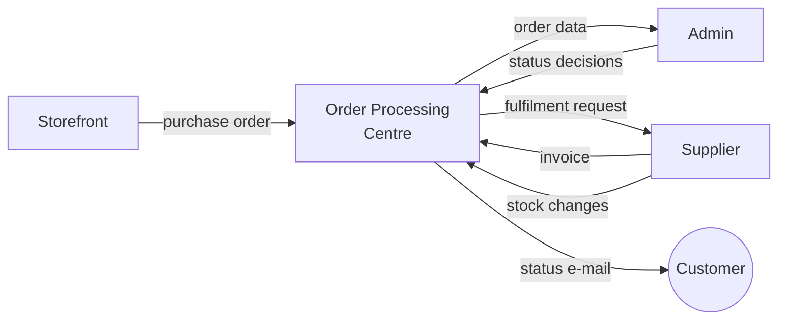
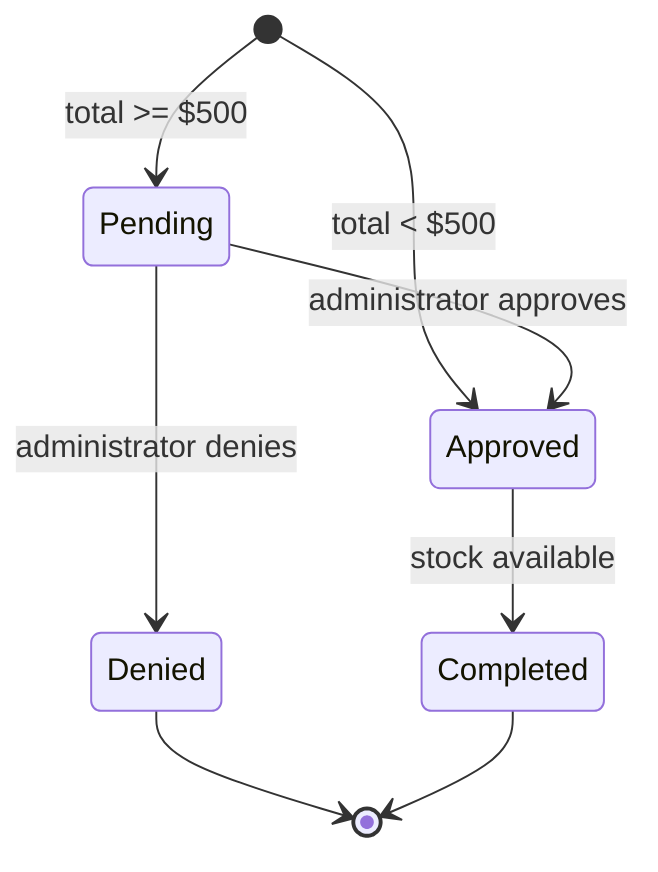
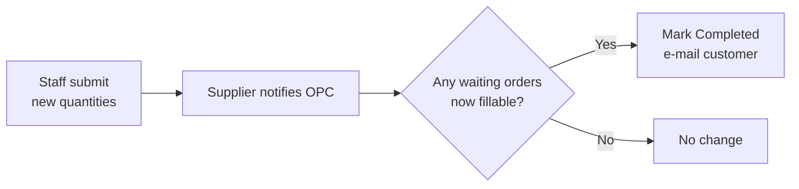
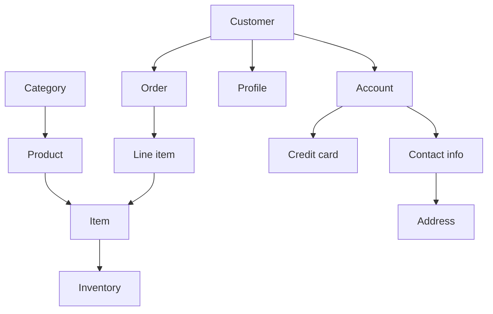

# Java Pet Store 1.3.2 — Product Requirements Document

2026-09-18 · @Someone

## Summary

Java Pet Store is an online pet shop that takes customer orders through a web storefront, routes them through an approval workflow, and fulfils them against supplier inventory — with the whole path from cart to shipment handled without manual re-keying between systems.

The product exists because an e-commerce order is not finished when the customer clicks Submit. It has to be checked for risk, matched against stock that may not be there yet, and released when it is. Pet Store covers that whole path in four applications that talk to each other asynchronously, so a slow supplier or a busy administrator never blocks a customer from ordering.

### About this document

This PRD is reconstructed from the Java Pet Store 1.3.2 source code. It describes what the shipped system does, stated as requirements, rather than what was originally specified before it was built. Numbers such as the $500 approval threshold are read from the code, not from an original product decision.

Use it as a baseline for a rebuild or a modernisation. Where the demo takes a shortcut that a real store could not, that is flagged rather than written up as a requirement.

## Goals and non-goals

### Goals

1. Let a customer find a pet, buy it and get a confirmation without signing in until checkout.
2. Hold high-value orders for human review while letting ordinary ones through untouched, so review effort scales with risk rather than volume.
3. Complete an order automatically once stock exists for it, with no one watching the queue.
4. Keep the customer informed at every status change without them returning to the site.
5. Serve the storefront in English, Japanese and Chinese, including catalogue content, not just labels.
6. Give administrators a view of what is selling, broken down by category and period.
7. Survive the supplier or the review queue being slow: neither should stop customers from ordering.

### Non-goals

| Not doing | Why |
| --- | --- |
| Real payment processing | Card details are stored and echoed back but never authorised or charged |
| Customer order history | The confirmation number is the only record the customer gets |
| Shipment tracking | Completed is the final status; there is nothing after it |
| Returns, refunds or cancellations | An order cannot be changed once submitted |
| Customer-facing stock levels | Availability is resolved after ordering, never shown before |
| Self-service password reset | There is no recovery path for a lost password |
| Multiple suppliers or sourcing choices | One supplier fills everything |
| Mobile or responsive layout | Fixed desktop-width tables throughout |

## Users and roles

Three roles, each with its own interface and no overlap between them.

| Role | Interface | Signs in | Can do |
| --- | --- | --- | --- |
| Shopper | Storefront, browser | At checkout | Browse, search, cart, order, manage own account |
| Administrator | Admin client, desktop | Always | Approve and deny pending orders, view sales reporting |
| Supplier staff | Supplier app, browser | Always | View and update inventory quantities |

### Shopper

Wants to find a specific pet quickly, see what it costs, and buy it with the fewest steps. Willing to create an account to complete a purchase, unwilling to create one just to look. Needs the site in their own language.

Can only see and change their own account. Has no view of order status after the confirmation screen and relies entirely on e-mail for it.

### Administrator

Reviews orders that carry real money risk and decides whether the store should honour them. Works in batches rather than one at a time, so the interface lets several decisions be staged and committed together.

Also the only role with a view of trading performance. Cannot edit orders, customers or the catalogue — the only change an administrator can make is a status decision.

### Supplier staff

Keeps recorded stock matching real stock. Their updates are what release orders that could not be filled, so the role is on the critical path for fulfilment even though it never touches an order.

Has no view of orders or customers at all.

Administrator and supplier sessions are mutually exclusive in one browser. A person holding both roles must sign out of one before using the other.

## System scope

Four independently deployable applications. Each owns its own data and is reachable only through its published interface.

| Application | Responsibility | Interface |
| --- | --- | --- |
| Storefront | Catalogue, accounts, cart, order capture | Web, customer-facing |
| Order Processing Centre | Approval rules, order lifecycle, fulfilment matching, notifications | None; message-driven |
| Admin | Order review queues and sales reporting | Desktop client over HTTP |
| Supplier | Inventory of record, invoicing | Web, staff-facing |

### Communication

The storefront hands an order to the OPC and returns to the customer immediately. It does not wait for the order to be reviewed, priced against stock or fulfilled. Every arrow into and out of the OPC on the diagram is asynchronous and durable for the same reason: a component that is down delays work rather than losing it.

Orders and invoices move between applications as documents with an agreed schema, so each side can change internally without breaking the other.

The admin client is the exception. It talks to the server synchronously over HTTP and expects an answer, which is why its tables load only when refreshed.

### Boundaries

The storefront never reads inventory. It will happily take an order for an item with no stock behind it, and the OPC resolves that afterwards. This is deliberate: it keeps ordering fast and keeps the supplier out of the customer's path.

The supplier never sees customer data. It receives line items to fill, not people to ship to.

## Functional requirements: storefront

### Accounts (SF-1)

| ID | Requirement |
| --- | --- |
| SF-1.1 | A visitor can browse, search and fill a cart without an account |
| SF-1.2 | Sign-in is required before the checkout form is shown, and the customer returns to checkout afterwards |
| SF-1.3 | Account creation captures contact details, one payment card and three profile preferences in a single form |
| SF-1.4 | A duplicate user name is rejected with a message; no partial account is created |
| SF-1.5 | A returning user name is remembered in a cookie and pre-filled at sign-in; the password never is |
| SF-1.6 | A customer can view and edit their own contact, card and profile details, but not their user name or password |
| SF-1.7 | Signing out ends the session and empties the cart |

### Catalogue (SF-2)

| ID | Requirement |
| --- | --- |
| SF-2.1 | The catalogue is three levels: category, product, item. Only items carry price and are purchasable |
| SF-2.2 | Five categories ship as reference data: Birds, Cats, Dogs, Fish, Reptiles |
| SF-2.3 | The home page offers an image map of the categories; a sidebar lists them as links on every page |
| SF-2.4 | Category, product and search listings are paged, with Previous and Next shown only when a page exists in that direction |
| SF-2.5 | An item page shows an image, list price, customer price and an add-to-cart action |
| SF-2.6 | Add-to-cart is available from listings and search results, not only from the item page |

### Search (SF-3)

| ID | Requirement |
| --- | --- |
| SF-3.1 | A search box is present in the banner on every page |
| SF-3.2 | Search matches any of the supplied keywords against item names and descriptions |
| SF-3.3 | Results are items, shown with description, price and add-to-cart |
| SF-3.4 | Paging through results preserves the keywords |
| SF-3.5 | An empty query or no matches returns an explicit no-results message, not an empty page |

### Cart (SF-4)

| ID | Requirement |
| --- | --- |
| SF-4.1 | Adding an item already in the cart increments its quantity rather than adding a second line |
| SF-4.2 | Quantities are editable per line and applied together on an explicit update action |
| SF-4.3 | Setting a quantity to zero removes the line |
| SF-4.4 | A line can be removed directly, without confirmation |
| SF-4.5 | A running subtotal is shown and recalculated on update |
| SF-4.6 | An empty cart shows an explicit message and offers no checkout path |
| SF-4.7 | The cart is session-scoped and does not survive sign-out |

### Checkout (SF-5)

| ID | Requirement |
| --- | --- |
| SF-5.1 | The checkout form captures billing and shipping addresses separately |
| SF-5.2 | Both addresses are pre-filled from the customer's account |
| SF-5.3 | All fields except the second address line are validated as non-empty before submission |
| SF-5.4 | Payment details are taken from the stored account card and not re-entered at checkout |
| SF-5.5 | A checkout attempt with an empty cart is rejected to a dedicated error screen |
| SF-5.6 | On success the customer receives an order identifier and the notification e-mail address on screen |
| SF-5.7 | The order is handed off asynchronously; the confirmation does not wait on approval or fulfilment |

### Personalisation and localisation (SF-6)

| ID | Requirement |
| --- | --- |
| SF-6.1 | A customer nominates a favourite category, which drives all personalised content |
| SF-6.2 | MyList, when enabled, shows up to ten products from the favourite category alongside shopping pages |
| SF-6.3 | Pet tips banners, when enabled, show advice matched to the favourite category |
| SF-6.4 | Both features are independently switchable and default to off |
| SF-6.5 | The storefront is available in English, Japanese and Chinese, including catalogue content |
| SF-6.6 | Language can be switched per session from any page, and set permanently in the profile |

## Functional requirements: order processing

The Order Processing Centre owns the order from the moment it leaves the storefront until it is completed or denied.

### Order lifecycle

An approved order with no stock behind it stays Approved. It is not a distinct status, which means a back-ordered item and a just-approved one look the same in the admin queue.

### Requirements

| ID | Requirement |
| --- | --- |
| OP-1.1 | Orders are received asynchronously and durably; an OPC outage delays processing but loses no order |
| OP-1.2 | An order with a total below $500 is approved automatically, with no human involvement |
| OP-1.3 | An order with a total of $500 or more is set to Pending and held for administrator review |
| OP-1.4 | The threshold is a single monetary value applied to the order total, not per line or per category |
| OP-1.5 | Every order carries exactly one of four statuses: Pending, Approved, Denied, Completed |
| OP-1.6 | Approval releases a fulfilment request to the supplier for each line item |
| OP-1.7 | An approved order whose items are not in stock waits, and is re-evaluated whenever supplier inventory changes |
| OP-1.8 | An order is marked Completed only when every line has been fulfilled |
| OP-1.9 | Denial is terminal: a denied order is never fulfilled and cannot return to Pending |
| OP-1.10 | Each status transition sends the customer an e-mail at the address on the order |
| OP-1.11 | Notifications are queued, so a mail outage does not block order processing |
| OP-1.12 | The OPC exposes order data and accepts status decisions for the admin client |

### Notes on the threshold

The $500 figure is fixed in the source, not configurable at deploy time. Any rebuild should make it a setting, and probably a rule set rather than a single number — the current design cannot express "review all orders from new customers" or "review anything shipping abroad".

A second threshold at $50,000 exists in the code but has no behaviour attached beyond the first, so all review effectively happens at one level.

## Functional requirements: administration

### Order review (AD-1)

| ID | Requirement |
| --- | --- |
| AD-1.1 | Pending orders and decided orders are shown in separate queues |
| AD-1.2 | Each order shows order number, customer, date, amount and status |
| AD-1.3 | Any column can be sorted |
| AD-1.4 | An administrator can set a pending order to Approved or Denied |
| AD-1.5 | Decisions are staged locally and sent to the server only on an explicit commit |
| AD-1.6 | Discarding staged decisions by refreshing requires confirmation |
| AD-1.7 | A committed decision cannot be reversed from the client |
| AD-1.8 | Decided orders are read-only |
| AD-1.9 | Data is loaded on demand; the client does not poll |

Batch commit is the defining behaviour here. It suits a reviewer working through a morning's queue, and it means an interrupted session loses the decisions rather than half-applying them.

There is no audit trail of who decided what. AD-1.7 makes decisions irreversible without recording who made them, which a production system would not accept.

### Sales reporting (AD-2)

| ID | Requirement |
| --- | --- |
| AD-2.1 | Sales are reported by pet category over a chosen date range |
| AD-2.2 | A pie chart shows each category's share of the total |
| AD-2.3 | A bar chart shows sales volume per category for comparison |
| AD-2.4 | The date range is set by a start and end date and applied on request |
| AD-2.5 | An unparseable date is reported to the user and no data is fetched |
| AD-2.6 | Reports are generated on demand, not scheduled or exported |

Reporting is limited to one dimension. There is no breakdown by product, item, customer or region, and no export, so the charts answer "what sells" and nothing more.

## Functional requirements: supplier

| ID | Requirement |
| --- | --- |
| SP-1.1 | Staff sign in before reaching any inventory screen |
| SP-1.2 | Inventory is listed as every item with its current quantity |
| SP-1.3 | Each row offers a new quantity field and a per-row update flag |
| SP-1.4 | Only rows whose update flag is set are written; an entered figure without the flag is discarded |
| SP-1.5 | An entered quantity replaces the stored figure rather than adjusting it |
| SP-1.6 | Multiple rows are submitted in one action |
| SP-1.7 | Every committed change notifies the OPC |
| SP-1.8 | The supplier fulfils order line items from inventory and issues an invoice to the OPC |
| SP-1.9 | The supplier receives no customer information, only line items |

### Restock as a trigger

SP-1.7 is the important one. An inventory update is not just a data change — it is the event that makes the OPC re-examine orders it could not previously fill, and complete any that the new stock covers.

This makes the supplier screen the release valve for the whole backlog, which is a lot of consequence for a screen with one submit button and no confirmation of what it unblocked. Staff get no feedback that their update completed twelve orders.

The per-row update flag of SP-1.4 is the main usability risk in the product: the obvious action, typing a number, does nothing on its own.

## Data model

### Catalogue

| Entity | Key attributes |
| --- | --- |
| Category | Identifier, localised name and description |
| Product | Identifier, category, localised name and description |
| Item | Identifier, product, attribute (such as Male Adult), list price, unit price, image, localised description |

Category, product and item names and descriptions vary by locale. Prices do not — one price serves all three locales, formatted per locale but never converted.

### Customer

| Entity | Key attributes |
| --- | --- |
| Customer | User identifier, links to account and profile |
| Account | Contact info, credit card, status |
| Contact info | Given name, family name, telephone, e-mail, address |
| Address | Two street lines, city, state or province, postal code, country |
| Credit card | Card number, card type, expiry month and year |
| Profile | Preferred language, favourite category, MyList flag, banner flag |
| Sign-on | User name and password, held separately from the customer record |

Credentials are deliberately separate from the customer record, so authentication can change without touching customer data.

### Order

| Entity | Key attributes |
| --- | --- |
| Cart | Session-scoped set of item identifiers and quantities. Never persisted |
| Purchase order | Order identifier, customer, order date, billing address, shipping address, card, line items, total, e-mail address |
| Line item | Item identifier, quantity, unit price at time of order, quantity shipped |
| Order status | Order identifier and its current status |
| Invoice | Supplier's record of what was shipped against an order |
| Inventory | Item identifier and quantity on hand |

A line item stores the unit price at the time of ordering, so a later price change does not alter an existing order. It also tracks quantity shipped separately from quantity ordered, which is what lets a partly-filled order be recognised as incomplete.

The order carries its own copy of the addresses and card rather than pointing at the customer record. A customer moving house does not rewrite their order history.

## Non-functional requirements

### Security

| ID | Requirement |
| --- | --- |
| NF-1.1 | Admin and supplier applications require authentication on every screen |
| NF-1.2 | The storefront requires authentication only for checkout and account management |
| NF-1.3 | A customer can read and write only their own account |
| NF-1.4 | Values rendered into pages are escaped, so user-supplied text cannot inject markup |
| NF-1.5 | Sessions are per browser; admin and supplier sessions are mutually exclusive |

Card numbers are stored and displayed in full. This was acceptable for a 2003 reference application and is not acceptable now — a rebuild must tokenise them and show only the last four digits.

### Performance

| ID | Requirement |
| --- | --- |
| NF-2.1 | Catalogue fragments that change rarely are cached rather than rebuilt per request |
| NF-2.2 | Cached fragments are held per locale, so a language switch never serves the wrong language |
| NF-2.3 | Cache entries expire on a fixed interval, currently five minutes |
| NF-2.4 | Listings are paged rather than returning whole result sets |
| NF-2.5 | Order handoff is asynchronous; checkout response time does not depend on downstream processing |

### Internationalisation

| ID | Requirement |
| --- | --- |
| NF-3.1 | English, Japanese and Chinese are supported end to end |
| NF-3.2 | Catalogue content is translated, not just interface labels |
| NF-3.3 | Request and response encoding is normalised so non-Latin input survives a round trip |
| NF-3.4 | Prices and dates are formatted per locale |
| NF-3.5 | Adding a locale requires new content and resource files, not code changes |

### Reliability and portability

| ID | Requirement |
| --- | --- |
| NF-4.1 | Messages between applications are durable; a component outage delays work rather than losing it |
| NF-4.2 | Applications deploy and fail independently |
| NF-4.3 | Database access is isolated behind data access objects with per-database SQL, so the schema can move between vendors |
| NF-4.4 | No application assumes another is reachable at the moment it sends |

NF-4.1 and NF-4.4 together are what let the store keep taking orders while the supplier or the review queue is down. They are the main architectural commitment in the product.

## Assumptions and constraints

### Assumptions

1. One supplier fills every order; there is no sourcing decision.
2. Every item has a single price in a single currency regardless of the customer's locale.
3. Customers accept e-mail as the only channel for order status.
4. Administrators work through the review queue in batches, not one order at a time.
5. Recorded inventory is accurate because staff keep it so; nothing reconciles it against physical stock.
6. The catalogue is small enough that categories fit in a sidebar and a five-way image map.

### Constraints

| Constraint | Effect |
| --- | --- |
| Approval threshold fixed in code | Cannot be tuned per market or season without a rebuild |
| Admin client is a desktop application | Needs a Java runtime; cannot be used from an unmanaged machine |
| Admin and supplier sessions mutually exclusive | One person cannot hold both roles at once |
| Fixed-width table layout | Unusable on narrow screens |
| Catalogue reference data fixed at five categories | Adding a category needs content and image-map work |

### Explicitly stubbed

These behave as if they work but do nothing, and must be built for real before any production use.

| Area | What actually happens |
| --- | --- |
| Payment | Card details are captured and stored; no authorisation, no charge, no decline path |
| Shipping | No carrier, no rates, no tracking. Completed means the supplier said so |
| Tax | Never calculated; the order total is the sum of the line items |
| Fraud and credit checks | The $500 rule is the entire risk model |
| Stock reservation | Nothing is held at order time, so two orders can be promised the same unit |

That last one is a real defect rather than a simplification. Because the storefront never reads inventory and nothing is reserved at checkout, concurrent orders for a scarce item are both accepted and resolved only later, in whatever order the OPC happens to process them.

## Known gaps and open questions

### Gaps a production version must close

| Gap | Why it matters | Suggested direction |
| --- | --- | --- |
| No stock reservation at checkout | Two customers can be sold the same animal | Reserve on order, release on denial or timeout |
| Card numbers stored in full | Fails any current payment standard | Tokenise; show last four digits only |
| No audit trail on approvals | Irreversible decisions with no record of who made them | Log actor, timestamp and prior status on every transition |
| No customer order history | The confirmation number is the customer's only record | An orders page keyed to the account |
| No cancellation or refund path | Every mistake becomes a support call | Cancel while Pending; refund flow after Completed |
| Approval threshold hard-coded | Cannot be tuned per market or season | Configurable rule set, not a single number |
| Back-order invisible in the admin queue | A waiting order looks identical to a fresh approval | Distinguish Awaiting stock from Approved |
| No feedback on supplier submit | Staff never learn their update released twelve orders | Report what completed on each inventory commit |

### Open questions

1. Should the approval threshold stay a single order-total rule, or become a rule set that can also consider customer age, destination and item category?
2. Should back-ordered orders become a distinct status, or stay Approved with a separate stock indicator?
3. How long may an approved order wait on stock before it is escalated or cancelled?
4. Should customers see availability before ordering, accepting the coupling to supplier data that the current design deliberately avoids?
5. Does the admin client need to stay a desktop application, or should the review queue move to the browser?
6. Should prices be per-locale rather than one price formatted three ways?
7. Who owns reconciling recorded inventory against physical stock, and how often?

Questions 1 and 2 are worth settling first — both change the order lifecycle, and everything else in the list can be built on top of whatever they decide.
