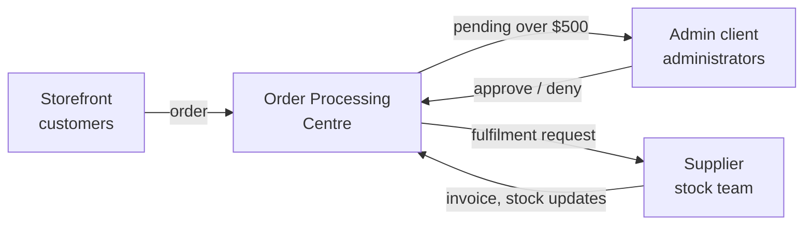
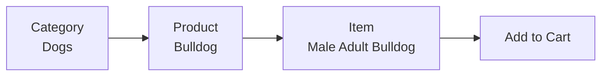
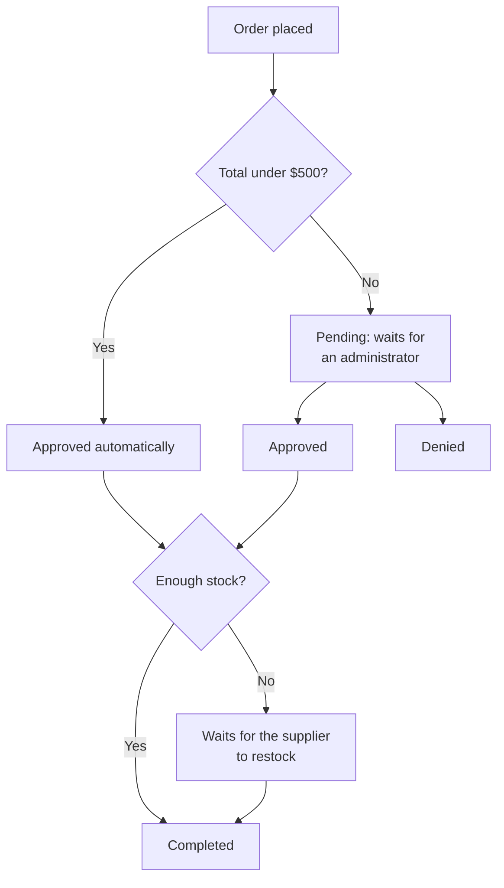

# Java Pet Store 1.3.2 — User Manual

2026-09-18 · @Someone

## About this manual

The Java Pet Store Demo 1.3.2 is an online pet shop made of four separate applications, and this manual covers all four: how a customer shops, how an administrator approves orders, and how a supplier keeps stock up to date.

The applications talk to each other asynchronously. A customer never sees the Order Processing Centre, but it decides whether their order goes through automatically or waits for a human.

Orders under $500 are approved without anyone touching them. Anything at or above $500 waits in the admin client until a person approves or denies it.

| Application | Who uses it | Interface | Covered in |
| --- | --- | --- | --- |
| Storefront | Customers | Web browser | Sections 3–8 |
| Order Processing Centre | Nobody directly | Background service | Section 7 |
| Admin client | Store administrators | Java desktop app | Sections 9–10 |
| Supplier | Stock and warehouse staff | Web browser | Section 11 |

If you only shop on the site, read sections 2 through 8 and skip the rest.

## Getting started

All three user interfaces run on the same server, on port 8000 by default.

| Application | Address | Sign-in needed |
| --- | --- | --- |
| Storefront | `http://localhost:8000/petstore` | Only at checkout |
| Admin client | `http://localhost:8000/admin/` | Yes |
| Supplier | `http://localhost:8000/supplier/` | Yes |

Substitute your own host name for `localhost` if the server is not on your machine.

**Sign-in details.** The demo ships with the user name `j2ee` and the password `j2ee` for the admin and supplier applications, and the storefront sign-in form is pre-filled with the same pair. Create your own storefront account rather than shopping as `j2ee`.

**Before you start.** The storefront and supplier need a current web browser with cookies enabled — the site keeps your cart and your sign-in in a session cookie. The admin client is a desktop application launched through Java Web Start, so the machine you run it from needs a Java runtime installed.

**First run.** The first time the catalogue is opened after installation, the database is filled with the sample pets. A "populating" page appears while this happens; wait for it to finish and the home page will load on its own.

Only one of the admin client and the supplier application can be signed in at a time in the same browser session. Sign out of the admin client before you open the supplier, or the second sign-in will fail.

## Signing in and creating an account

You can browse and fill a cart without signing in. You are asked to sign in only when you start checkout.

### Signing in

1. Click **Sign in** at the top right of any page.
2. Enter your user name and password on the left-hand side of the Sign In screen, under "Are you a returning customer?"
3. Click **Sign In**.

If you have signed in on this browser before, your user name is filled in for you from a cookie and only the password is blank. After signing in you are returned to the page you were on, so a sign-in during checkout drops you straight back into the order form.

### Creating an account

On the right-hand side of the Sign In screen, under "I would like to sign up for an account", enter a user name and password and click **Create New Account**. The account form then opens in three parts.

**Contact information** — first name, last name, street address (a second line is optional), city, state or province, postal code, country, telephone number and e-mail address. State is a list of California, New York and Texas; country is a list of United States, Canada, Japan and China.

**Credit card information** — card number, card type (Java Card, Duke Express or Meow Card) and an expiry month and year.

**Profile information** — three preferences you can change later at any time:

| Preference | What it does |
| --- | --- |
| Language | Sets the language of the storefront: English, Japanese or Chinese |
| Favourite category | Chooses which category feeds the MyList panel: Birds, Cats, Dogs, Fish or Reptiles |
| MyList | When ticked, shows a MyList panel of pets from your favourite category as you shop |
| Pet tips banners | When ticked, shows pet-care tips chosen to match your favourite category |

Click **Submit** to finish. You are signed in and taken to the home page.

The form arrives with sample values already in the fields. Replace them with your own before submitting — the demo will happily save "Duke BluesPrints" as your name.

If the user name you chose is already taken, the account is not created and a message tells you so. Go back and try a different one.

### Signing out

Click **Sign out** at the top right. Your cart is emptied and you are returned to the home page as an anonymous visitor.

## Browsing the catalogue

The catalogue has three levels. A category holds products, a product holds the individual items you can buy, and only an item has a price and can go in your cart.

So "Dogs" is a category, "Bulldog" is a product, and "Male Adult Bulldog" is the item with a price on it.

### Two ways in

The home page shows a picture of five pets. Click any animal in the picture to open its category.

The **Pets** panel on the left of every page lists the five categories as plain links: Birds, Cats, Dogs, Fish and Reptiles. Use it to jump between categories without going back to the home page.

### Working down to an item

1. Open a category. The page lists the products in it, each with a short description.
2. Click a product name. The page lists the items for that product, each with its own description and price.
3. Click an item name to see its full page: a photograph, the list price, your price, and an **Add to Cart** link.

You do not have to open the item page to buy. Both the category listing and the product listing have their own **Add to Cart** links.

### Paging through long lists

Category, product and search listings show two entries at a time. Use the **Previous** and **Next** links at the bottom right to move through the rest. A link only appears when there is something in that direction, so on the first page you will see **Next** alone.

### The MyList panel

If you switched MyList on in your profile, a **My List** panel appears on the left below the Pets panel, listing up to ten products from your favourite category. It is a shortcut, not a saved basket — clicking an entry opens that product page.

MyList only shows once you are signed in, because it reads the favourite category from your profile.

## Searching

The search box sits in the banner at the top right of every page, beside the **Search** button.

Type one or more words and click **Search**. The search matches on any of the words you type, not all of them, so "golden retriever" returns everything matching "golden" as well as everything matching "retriever". Fewer, more distinctive words give tighter results.

Search looks at item names and descriptions and returns individual items, not products or categories. Each result shows the item name, its description, its price and an **Add to Cart** link, so you can buy straight from the results list without opening the item.

Results are shown two at a time with the same **Previous** and **Next** links used elsewhere. Moving between result pages keeps your search words, so you do not have to retype them.

If nothing matches, the page reads "No results were found for your search." The same message appears if you click **Search** with the box empty. Try a shorter word or a different spelling — the search does not correct typos or find plurals of a word you typed in the singular.

## The shopping cart

Click **Cart** in the banner to open your cart from anywhere on the site.

### Adding items

Click **Add to Cart** wherever you see it — on the item page, in a product listing, or in a search result. The item is added with a quantity of one and the cart opens. Adding an item you already have raises its quantity instead of creating a second line.

### What the cart shows

Each line gives the item name as a link back to its page, a **Remove** link, a quantity box you can type in, and the unit price. The cart total is in the highlighted cell at the bottom right.

| Control | What it does |
| --- | --- |
| Item name | Opens that item's page |
| Remove | Takes the line out of the cart immediately, with no confirmation |
| Quantity box | Sets how many you want — takes effect only when you click Update Cart |
| Update Cart | Applies every quantity you have typed and recalculates the total |
| Check Out | Starts the order |

### Changing quantities

Type the new number over the old one in the quantity box, then click **Update Cart**. You can change several lines and update them all at once. Setting a quantity to zero removes the line.

Typing a new quantity is not enough on its own — if you go straight to **Check Out** without clicking **Update Cart**, your typed numbers are lost and the old quantities are ordered.

### An empty cart

An empty cart reads "Your Shopping Cart is Empty." with no table and no checkout link. Your cart is also emptied when you sign out.

When you are ready, click **Check Out**.

## Checking out

Clicking **Check Out** opens the order form. If you are not signed in yet, the sign-in screen appears first and you are returned to the order form afterwards.

### Filling in the order form

The form has two halves. **Billing Information** comes first, then **Shipping Information** below it. Both ask for first name, last name, street address (with an optional second line), city, state or province, postal code, country, telephone and e-mail.

Both halves arrive filled in from your account, so if you are shipping to yourself you can read them over and submit. Change the shipping half if the pets are going somewhere else.

Every field except the second address line must have something in it. If you clear one and submit, the page comes back with the problem marked rather than placing the order.

The form does not repeat your credit card details. The card saved on your account is the one that will be charged; change it on your account page before checking out if you want a different one.

Click **Submit** to place the order.

### The confirmation screen

"Your Order is Complete" appears with your order number and the e-mail address the confirmation is going to. Write the order number down — the storefront gives you no way to look up an old order afterwards.

### What happens next

Your order is passed to the Order Processing Centre, which decides what happens to it:

An approved order still needs stock behind it. If the supplier cannot fill it yet, it sits and waits until stock arrives, at which point it completes on its own.

Every step that changes your order's status sends you an e-mail, so you find out about approval, denial or completion without coming back to the site.

## Managing your account

Click **Account** in the banner to see everything held about you: contact details, card type, card number and expiry, and your three profile preferences. MyList and pet tips show as a green **Yes** or a red **No**.

This page is read-only. Click **Edit Your Account Information** at the bottom to change anything.

### Editing your details

The edit form is the same shape as the one you filled in when you created the account, with your current values in it. Change what you need and click **Submit**. You cannot change your user name or password here.

Changing your address does not change orders you have already placed.

### Changing the language

Three small flags sit under the banner on every page: United States for English, Japan for Japanese, China for Chinese. Click one to switch the site straight away.

The flags change the language for this visit only. To make it stick, set **I want MyPetStore to be in** on your account page — that is the language used every time you sign in.

The product names and descriptions in the catalogue are translated too, not just the buttons and labels.

### Tuning what you see

Two tick boxes on the account form control the extras on the shopping pages.

| Setting | Ticked | Unticked |
| --- | --- | --- |
| MyList | A My List panel of pets from your favourite category appears on the left | No panel |
| Pet tips banners | A banner of pet-care tips matched to your favourite category appears | No banner |

Both follow your **favourite category**, so changing that from Birds to Dogs changes what the panel and the banner show. Neither affects prices or what you can buy.

## Administrator client: managing orders

The admin client is a desktop application for store administrators. Customers never see it.

### Opening it

1. Go to `http://localhost:8000/admin/` and sign in with an administrator account.
2. Click **Launch Rich Client**.
3. The client downloads through Java Web Start and opens in its own window.

Sign out of the admin web page when you have finished, before opening the supplier application.

### Finding your way around

The toolbar has two buttons that switch the whole window between views — **Orders** and **Sales** — plus **Refresh** to reload from the server and **About**. The same choices are on the View menu, and File holds Exit.

The Orders view has two tabs:

| Tab | Shows | What you can do |
| --- | --- | --- |
| Process Pending Orders | Orders waiting for a decision | Approve or deny them |
| View Non-Pending Orders | Orders already approved, denied or completed | Read only |

Both tables have the same five columns: order number, customer, date, amount and status. Click a column heading to sort by it.

If a table looks empty, click **Refresh** — the client does not poll the server on its own.

### Approving and denying

1. Click the **Process Pending Orders** tab.
2. Click the row of the order you want to decide on.
3. Click its **Status** cell and choose **Approved** or **Denied**.
4. Repeat for as many orders as you like.
5. Click **Commit** to send all your decisions to the server.

Nothing is sent until you click **Commit**. If you click **Refresh** with uncommitted changes, a warning asks whether you really want to discard them.

Once committed, a decision cannot be undone from the client. The order moves to the Non-Pending tab and the customer is e-mailed.

### Why an order is pending

An order waits for you only when its total is $500 or more. Anything below that is approved automatically and appears in the Non-Pending tab without ever passing through your queue.

### The four statuses

| Status | Meaning |
| --- | --- |
| Pending | Waiting for an administrator to approve or deny |
| Approved | Cleared, now waiting on the supplier for stock |
| Denied | Rejected; it will not be fulfilled |
| Completed | Fulfilled and shipped by the supplier |

## Administrator client: sales charts

Click **Sales** in the toolbar to see what has sold, broken down by the five pet categories.

The view has two tabs. The **Pie Chart** shows each category's share of sales over the period. The **Bar Chart** shows the number of sales per category, so you can compare volumes directly.

### Choosing a period

Both charts are driven by the same pair of date boxes at the top, **Start Date** and **End Date**. Type the two dates and click the fetch button to pull the figures.

Dates must be typed in the format the client expects for your locale. A date it cannot read raises a format error dialog and no data is fetched — correct the date and try again.

The charts do not refresh themselves. Fetch again after committing new order decisions if you want them reflected.

Sales figures count orders, so a run of large denials will show up as a drop in a category even though customers tried to buy.

## Supplier: managing inventory

The supplier application is a small web interface for keeping stock levels current. It is where warehouse staff tell the system how many of each item are actually on the shelf.

### Opening it

Sign out of the admin client first — the two applications cannot be signed in at the same time in one browser session.

Go to `http://localhost:8000/supplier/`, sign in, and click **Display Inventory**.

### Updating stock

The inventory table lists every item with its current quantity, a **New Quantity** box and an **Update** tick box.

1. Type the new figure in the **New Quantity** box for an item.
2. Tick **Update** on that row.
3. Repeat for every item you are changing.
4. Click **Submit**.

A row is saved only if its **Update** box is ticked. Typing a number and leaving the box unticked changes nothing — this is the most common mistake in this screen.

Quantities you enter replace the stored figure. They are not added to it.

### What your update sets off

Every time you submit, the supplier tells the Order Processing Centre what changed. The OPC looks again at approved orders it could not fill before, and any that the new stock covers are marked completed and the customer is e-mailed.

So entering stock is also how you release orders that have been waiting. An order stuck in Approved usually means the item behind it is out of stock here.

## Troubleshooting

| What you see | Why | What to do |
| --- | --- | --- |
| Sign-in failed | The user name or password did not match | Retype the password — it is case-sensitive. The demo has no password reset, so an administrator must create a new account if it is lost |
| Account already exists | The user name you chose is taken | Go back and pick a different user name. Your other details are not saved |
| Cannot check out with an empty cart | Checkout was reached with nothing in the cart, usually after signing out mid-order or setting every quantity to zero | Add items and check out again |
| A general error page | Something failed on the server | Go back to the home page and retry. If it recurs, the server or database is probably down |
| "Populating" page that does not finish | The catalogue is being loaded for the first time | Wait a minute and reload. If it stays, the database connection is misconfigured |

### Things that are not faults

**The cart emptied itself.** Signing out clears the cart. So does letting the session expire after a long idle period.

**My quantity change did not take.** In the cart you must click **Update Cart**; in the supplier inventory you must tick **Update** on the row. Typing alone saves nothing in either screen.

**The site went back to English.** The flag icons change the language for the current visit only. Set the language on your account page to make it permanent.

**My order still says Approved.** Approved means cleared but not yet in stock. It completes on its own once the supplier enters enough inventory.

**The admin tables are empty.** Click **Refresh**. The client loads data only when asked.

## Reference

### Storefront screens

Every page is reached from a link in the interface; the addresses are here for bookmarking and support calls.

| Screen | Address | Reached from |
| --- | --- | --- |
| Home | `main.screen` | The logo in the banner |
| Category listing | `category.screen?category_id=` | Home page picture, Pets panel |
| Product listing | `product.screen?product_id=` | A product name in a category |
| Item detail | `item.screen?item_id=` | An item name in a product listing, search result or cart |
| Search results | `search.screen?keywords=` | The banner search box |
| Cart | `cart.do` | Cart in the banner, or Add to Cart |
| Checkout form | `enter_order_information.screen` | Check Out in the cart |
| Order confirmation | `order.do` | Submit on the checkout form |
| Account | `customer.do` | Account in the banner |
| Edit account | `update_customer.screen` | Edit Your Account Information |
| Sign in | `signon_welcome.screen` | Sign in in the banner |
| Sign out | `signoff.do` | Sign out in the banner |
| Change language | `changelocale.do` | A flag icon |

Category identifiers are `BIRDS`, `CATS`, `DOGS`, `FISH` and `REPTILES`.

### Glossary

| Term | Meaning |
| --- | --- |
| Category | The top level of the catalogue — one of the five kinds of pet |
| Product | A breed or variety within a category, such as Bulldog |
| Item | A specific pet you can buy, such as Male Adult Bulldog. Only items have prices |
| Cart | Items you have chosen but not yet ordered. Cleared when you sign out |
| Order | A submitted cart, with a number and a status |
| Pending | An order of $500 or more waiting for an administrator |
| Approved | Cleared by rule or by an administrator, waiting on stock |
| Denied | Rejected by an administrator |
| Completed | Fulfilled by the supplier |
| OPC | Order Processing Centre — the background service that routes orders |
| Supplier | The application and team holding the stock that fills orders |
| MyList | An optional panel of pets from your favourite category |
| Pet tips banner | An optional banner of care advice matched to your favourite category |
